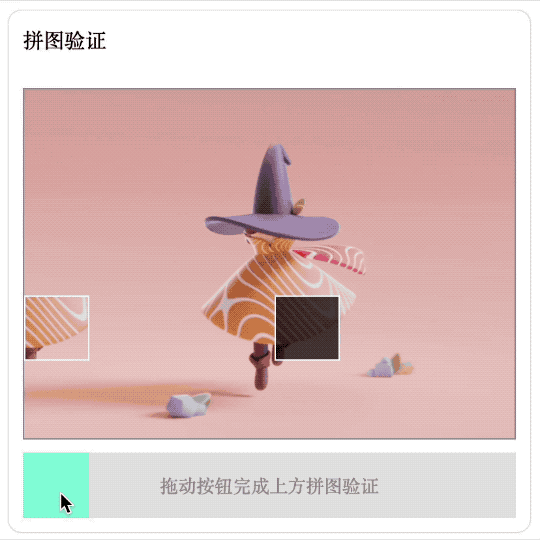
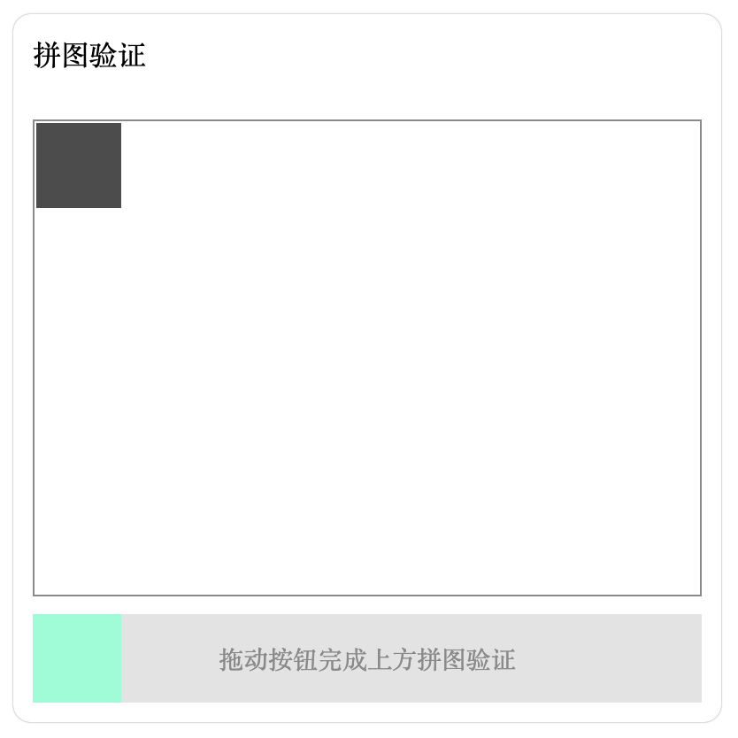
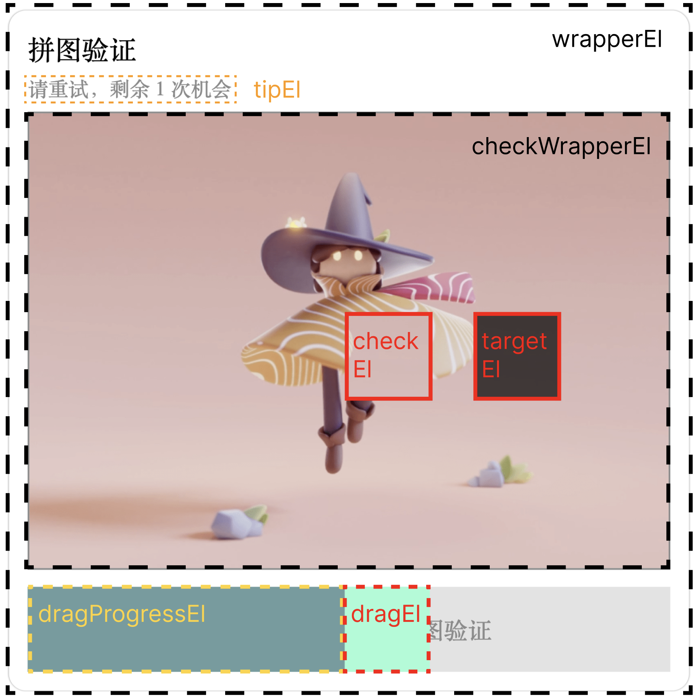
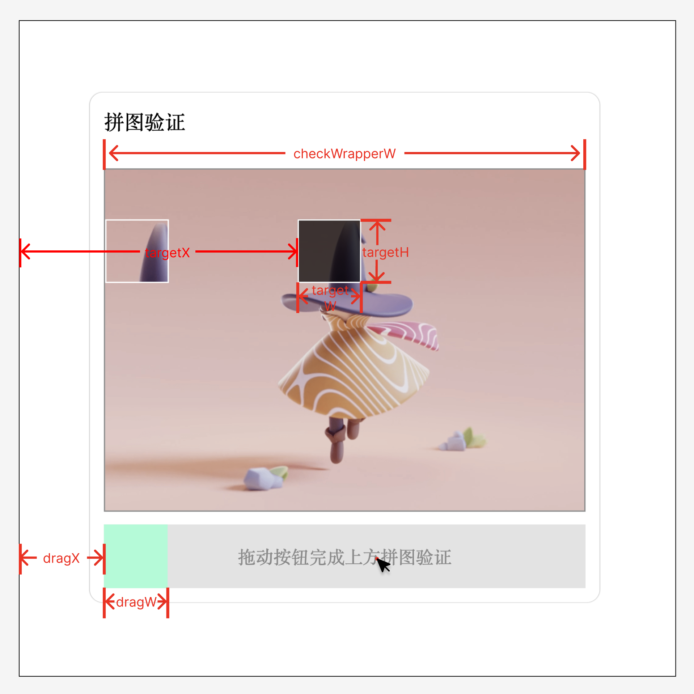
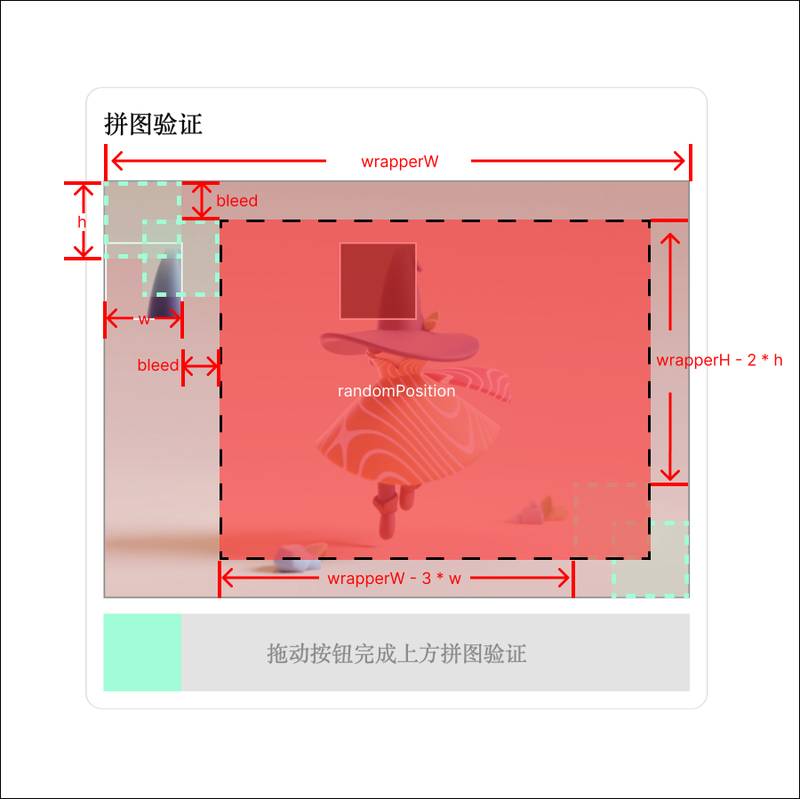

# 拼图验证组件 🧩
使用 HTML + CSS + JavaScript 原生实现的拼图验证组件  



## HTML 结构
拼图验证组件需要以下几种元素：
- 拼图区（图片）
  - 拼图
  - 拼图插槽
  - 成功反馈
- 拖动区
  - 拖动滑块
  - 滑动进度条
  - 提示文字

组件垂直布局，上为拼图区，下为拖动条。拼图将覆盖在插槽上，层级更高；进度条在拖动滑块左边，将覆盖在提示文字上方。因此结构如下：
```HTML
<div>
  <div class="verification">
    <p class="title">拼图验证</p>
    <p class="tip"></p>

    <!-- 拼图区 -->
    <div class="check-wrapper">
      <!-- 目标插槽 -->
      <div class="check-target"></div>

      <!-- 拼图 -->
      <div class="check-box"></div>

      <!-- 成功 -->
      <div class="check-state">
        </img>
        <p>验证成功</p>
        <button type="button" class="resetButton">确认</button>
      </div>
    </div>

    <!-- 拖动区 -->
    <div class="drag-wrapper">
      <p class="drag-tip">
        <span>拖动按钮完成上方拼图验证</span>
      </p>

      <!-- 已拖过的进度条 -->
      <div class="drag-progress"></div>
      <!-- 拖动滑块 -->
      <div class="drag-box"></div>
    </div>
  </div>
</div>
```

## CSS 样式
组件常出现于页面正中，因此这里使用固定定位 `fixed`。如果只是希望相对于父组件定位，可以把 `position` 改成 `absolute`。组件内部使用 `flex` 垂直布局。

```CSS
.verification {
  display: flex;
  align-items: center;
  flex-direction: column;
  width: 400px;
  height: 400px;
  margin: auto;
  padding: 10px;
  border-radius: 10px;
  box-shadow: 0px 0 1px 0px #8a8a8a;
  border: 1px transparent solid;
  position: fixed;
  inset: 0;
  box-sizing: border-box;
}

.title,
.tip {
  margin: 0 0 4px 0;
  align-self: flex-start;
}

.tip {
  height: 1em;
  margin-bottom: 10px;
  font-size: 12px;
  color: #8a8a8a;
}
```

### 拼图区
在没有全局初始化 `box-sizing` 默认值的时候，有 `border` 属性的样式我都会手动加上 `box-sizing: border-box;` ，使得实际宽度符合预期。
```CSS
.check-wrapper {
  width: 100%;
  height: 300px;
  border: 1px solid #8a8a8a;
  background-repeat: no-repeat;
  background-size: 100% 100%;
  position: relative;
  box-sizing: border-box;
}
```

拼图和插槽都使用绝对定位 `absolute`，位置由 js 计算随机生成 `top` 和 `left` 得到：
```CSS
.check-box {
  width: 50px;
  height: 50px;
  border: 1px solid #fff;
  background-image: inherit;
  background-repeat: inherit;
  position: absolute;
  box-sizing: border-box;
}

.check-target {
  width: 50px;
  height: 50px;
  background: rgba(0, 0, 0, 0.7);
  border: 1px solid #fff;
  position: absolute;
  box-sizing: border-box;
}
```

### 拖动区
```CSS
.drag-wrapper {
  width: 100%;
  height: 50px;
  background-color: #e3e3e3;
  margin-top: 10px;
  position: relative; 
  display: flex;
  align-items: center;
  justify-content: center;
}

.drag-tip {
  font-size: 14px;
  color: #8a8a8a;
  user-select: none;
}
```

滑块和进度条初始位置在拖动条的最左边，因此设置 `top` 和 `left` 为 0；拖动后的滑块位置通过 js 控制 `transform` 实现，进度条的宽度也将由 js 计算控制：
```CSS
.drag-box {
  width: 50px;
  height: 100%;
  background-color: aquamarine;
  position: absolute;
  top: 0;
  left: 0;
}

.drag-progress {
  height: 50px;
  background-color: cadetblue;
  position: absolute;
  left: 0;
  top: 0;
}
```

拼图验证失败后，滑块和进度条会平滑回到原点，整个组件出现红色边框并伴随抖动：
```CSS
@keyframes move {
  to {
    transform: translateX(0);
  }
}

@keyframes elongation {
  to {
    width: 0px;
  }
}

@keyframes failShake {
  0% {
    transform: translateX(0px);
    border: 1px red solid;
  }

  25% {
    transform: translateX(5px);
  }

  50% {
    transform: translateX(-5px);
  }

  75% {
    transform: translateX(5px);
  }

  100% {
    transform: translateX(0px);
  }
}
```

`check-wrapper` 和 `drag-wrapper` 都需要设置 `position` 属性，因为他们有绝对定位的子元素，要相对于他们定位。如果没有设置 `position` 属性，子元素会基于最近一个设置了 `position` 属性的节点定位，直到根节点。



## JavaScript 逻辑
桌面端实现拼图的原理是监听 `mousedown` 、`mousemove` 和 `mouseup` 方法，鼠标点击后移动，计算鼠标移动的距离，然后控制滑块的 `transform: translateX(..px)`，以实现滑动移动的效果。`check-box` 和 `drag-box` 平行同步位移。

验证成功的依据是判断滑块是否与插槽重合，验证成功会调用 `success` 方法，失败调用 `reset` 方法。若失败 3 次以上，将刷新背景图和拼图插槽位置。

需要考虑滑块的边界条件和容差范围。

### 全局变量
拿到要操作的 Element

```JavaScript
const wrapperEl = document.querySelector('.verification')
const tipEl = document.querySelector('.tip')

// 拼图区
const checkWrapperEl = document.querySelector('.check-wrapper')
const checkEl = document.querySelector('.check-box')
const targetEl = document.querySelector('.check-target')

// 拖动区
const dragEl = document.querySelector('.drag-box')
const dragProgressEl = document.querySelector('.drag-progress')

// 结果区
const stateEl = document.querySelector('.check-state')
const resetButtonEl = document.querySelector('.resetButton') // 校验成功页确认按钮
```

计算实际渲染的位置和尺寸

```JavaScript
const { width: checkWrapperW } = checkWrapperEl.getBoundingClientRect()
const { x: dragX, width: dragW } = dragEl.getBoundingClientRect()
const { width: targetW, height: targetH } = targetEl.getBoundingClientRect()
```

声明一些常量和变量
```JavaScript
const tolerances = 5 // 容差
let clickOffsetX = 0 // 鼠标到滑块左边的距离
let targetX = 50 // 拼图插槽到页面最左边的距离
let failTimes = 0 // 拖动失败次数
```

### 随机生成背景图和拼图插槽
随机生成拼图插槽，出现在图中红色区域    

```JavaScript
const randomPosition = (wrapperW = 400, wrapperH = 300, w = 50, h = 50) => {
  const bleed = w / 2 // 出血
  const left = Math.random() * (wrapperW - 3 * w) + w + bleed
  const top = Math.random() * (wrapperH - 2 * h) + bleed

  return [Math.floor(left), Math.floor(top)]
}
```

从图片列表中随机选择图片
```JavaScript
const randomImage = (checkWrapperEl) => {
  const imageList = [
    'https://cos.rayjason.cn/images/temp1.png',
    'https://cos.rayjason.cn/images/temp2.png',
  ]
  const index = Math.round(Math.random() * (imageList.length - 1))

  checkWrapperEl.style.backgroundImage = `url(${imageList[index]})`
}
```

初始化拼图组件
```JavaScript
function init(targetEl, checkEl, targetW = 50, targetH = 50) {
  // 随机生成图片
  randomImage(checkWrapperEl)

  const { width: cwW, height: cwH } = checkWrapperEl.getBoundingClientRect()
  // 设置拼图插槽随机位置
  const [targetLeft, targetTop] = randomPosition(cwW, cwH, targetW, targetH)
  targetEl.style.left = `${targetLeft}px`
  targetEl.style.top = `${targetTop}px`
  checkEl.style.top = `${targetTop}px`

  // 设置拼图背景
  checkEl.style.backgroundSize = `${cwW}px ${cwH}px`
  checkEl.style.backgroundPosition = `-${targetLeft}px -${targetTop}px`

  // 初始化一些全局变量
  targetX = targetEl.getBoundingClientRect().x
  failTimes = 0
  dragTimes.innerHTML = ``
}
```

### 声明回调方法
成功通过校验
```JavaScript
// 成功通过校验
const onButtonClick = (event) => {
  reset()
  init(targetEl, checkEl, targetW, targetH)
  resetButtonEl.removeEventListener('click', onButtonClick)
  stateEl.style.display = 'none'
}

const success = () => {
  stateEl.style.display = 'flex'
  resetButtonEl.addEventListener('click', onButtonClick)
}
```

回到起点，无过渡动画。适用于初始化。
```JavaScript
const reset = () => {
  dragEl.style.transform = 'translateX(0px)'
  checkEl.style.transform = 'translateX(0px)'
  dragProgressEl.style.width = '0px'
}
```

回到起点，有过渡动画。适用于拼图失败后滑块缓动回到起点。
```JavaScript
const animateReset = () => {
  // 添加过渡动画
  wrapperEl.style.animation = 'failShake 0.5s ease-in-out'
  dragEl.style.animation = 'move 0.5s ease-in-out'
  checkEl.style.animation = 'move 0.5s ease-in-out'
  dragProgressEl.style.animation = 'elongation 0.5s ease-in-out'

  // 动画结束回调
  const animationEnd = () => {
    reset()

    // 清除过渡动画
    wrapperEl.style.animation = ''
    dragEl.style.animation = ''
    checkEl.style.animation = ''
    dragProgressEl.style.animation = ''

    document.removeEventListener('animationend', animationEnd)
  }

  // 添加监听动画结束
  document.addEventListener('animationend', animationEnd)
}
```

### 声明监听事件回调
滑块移动的距离需要考虑边界范围

```JavaScript
// 鼠标按下事件
const onDragMouseDown = (event) => {
  // 添加鼠标移动事件
  document.addEventListener('mousemove', onDragMouseMove)
  // 添加鼠标弹起事件
  document.addEventListener('mouseup', onDragMouseUP)

  const { offsetX } = event
  clickOffsetX = offsetX
}

// 监听鼠标移动事件
const onDragMouseMove = (event) => {
  const { pageX } = event // 鼠标的 x 坐标
  const x = pageX - dragX - clickOffsetX // drag 移动的距离

  // 鼠标移出左边界
  if (x < 0) {
    if (dragEl.style.transform !== 'translateX(0px)') {
      dragEl.style.transform = 'translateX(0px)'
      checkEl.style.transform = 'translateX(0px)'
      dragProgressEl.style.width = '0px'
    }
    return
  }

  // 鼠标移出右边界
  const rightBoundary = checkWrapperW - dragW
  if (x > rightBoundary) {
    if (dragEl.style.transform !== `translateX(${rightBoundary}px)`) {
      dragEl.style.transform = `translateX(${rightBoundary}px)`
      checkEl.style.transform = `translateX(${rightBoundary}px)`
      dragProgressEl.style.width = `${rightBoundary}px`
    }
    return
  }

  // 修改盒子坐标
  dragEl.style.transform = `translateX(${x}px)`
  checkEl.style.transform = `translateX(${x}px)`
  dragProgressEl.style.width = `${x}px`
}

// 结束鼠标监听事件
const onDragMouseUP = (event) => {
  document.removeEventListener('mousemove', onDragMouseMove)
  document.removeEventListener('mouseup', onDragMouseUP)

  const { pageX } = event

  const passRange = [
    targetX - tolerances + clickOffsetX,
    targetX + tolerances + clickOffsetX,
  ]

  if (pageX >= passRange[0] && pageX <= passRange[1]) {
    success()
  } else {
    if (failTimes > 1) {
      reset()
      init(targetEl, checkEl, targetW, targetH)
      return
    }
    failTimes++
    tipEl.innerHTML = `请重试，剩余 ${3 - failTimes} 次机会`
    animateReset()
  }
}
```

### 执行
监听滑块的点击事件，只有点击滑块才会触发回调事件。  
拖动滑块或拼图都能移动滑块位置。
```JavaScript
const main = () => {
  init(targetEl, checkEl, targetW, targetH)

  dragEl.addEventListener('mousedown', onDragMouseDown)
  checkEl.addEventListener('mousedown', onDragMouseDown)
}

main()
```

## 总结
实现这个组件中需要掌握以下能力：
- 通过 className 查询节点：`document.querySelector('.className')`
- 修改节点样式：`dragEl.style.transform = 'translateX(0px)'`
- 监听按钮事件： `buttonEl.addEventListener('click', onButtonClick)` 
- 移除监听事件： `buttonEl.removeEventListener('click', onButtonClick)` 
- 计算节点的位置和尺寸：`const { x: dragX, width: dragW } = dragEl.getBoundingClientRect()`
- 了解 `offsetX` / `pageX` / `x` / `clientX` 等属性的区别

现在前端项目的开发很少使用原生去实现了，写这篇文章的目的就是复习一下操作 DOM 和计算页面节点位置的方法。只要掌握了思路，无论什么框架都可以轻松移植。

组件的不足之处就是没有适配移动端，可以通过监听 `touchstart` / `touchmove` / `touchend` 来实现，因为 touch 事件和 mouse 事件返回的属性有出入，我这里暂时没有精力适配了，欢迎有余力的朋友补充。如果文中有错误或可以优化的地方，请在 issue 讨论，感恩！

